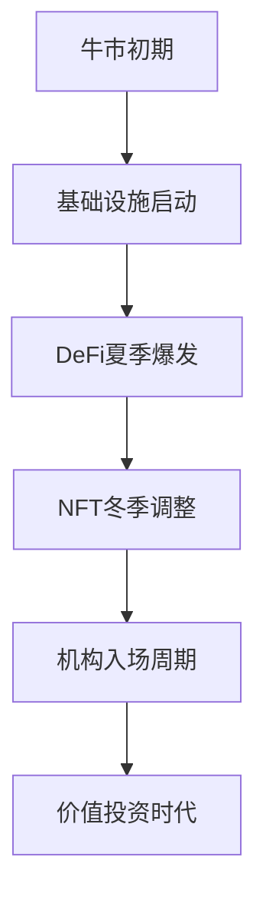

# LD Capital 创始人 Jack Yi：从市场波动中洞察以太坊的未来潜力

## 核心观点提炼
- 以太坊作为**金融基础设施**和加密原生创新中心，生态实力持续领跑行业
- ETH价格被预测具有**十倍以上增长潜力**，长期价值获机构看好
- 市场波动中建议采取**长期持有+专业投研**双轨策略应对
- 加密行业正经历从**周期波动**向主流金融融合的范式转变

---

## 从1700美元到暴涨70%：以太坊的逆袭之路
自LD Capital在1700美元价位发布以太坊研报以来，市场给出了令人惊喜的反馈——短短十余天内价格飙升超70%。这种强势反弹印证了机构对市场趋势的精准判断。

👉 [深入解析以太坊生态优势](https://bit.ly/okx_welcome)  
作为从业15年的加密老兵，Jack Yi将这次成功归因于对**市场周期**的深刻认知。从2015年接触加密货币至今，他亲历了完整的牛熊周期洗礼：从早期参与比特币挖矿，到2017年新项目热潮，再到经历312黑天鹅事件后的涅槃重生。这些实战经验塑造了LD Capital独特的投资哲学。

---

## 以太坊价值重构：1万美元目标价的底层逻辑
面对市场对ETH突破万刀的质疑，Jack Yi给出了三大核心依据：

| 驱动因素        | 具体表现                          |
|-----------------|-----------------------------------|
| 基础设施优势    | L1生态复兴计划加速推进            |
| 市场供需重构    | 千万级ETH空头头寸提供反弹动能     |
| 行业定位升级    | 金融替代升级赛道领跑者            |

"当ETH在1700美元时，全网空头持仓量高达千万ETH，这种极端行情往往孕育着历史性机会。"Jack Yi特别强调，ETH作为**加密金融基础设施**的地位不可替代，其承载的DeFi、NFT、Web3等创新应用持续创造价值。

---

## 牛市前夜的生存法则：投资者行动指南
在当前市场阶段，机构建议采取差异化操作策略：

- **已持仓者**：建议持有至牛市周期尾声，历史数据显示长期持有可有效穿越周期
- **观望者**：采用定投策略分批建仓，关注回调机会
- **专业投资者**：可配置ETH生态优质资产（如UNI、AAVE等），但需注意项目风险评估

👉 [获取专业级投资策略白皮书](https://bit.ly/okx_welcome)  
针对市场波动管理，Jack Yi提出"周期锚定法"：通过拉长投资周期平滑价格波动，设定动态止盈止损区间。他特别指出："真正的价值投资需要忍受30%-40%的正常回撤波动。"

---

## 未来十年：以太坊的万亿级市场想象空间
从行业本质出发，Jack Yi认为区块链最大的价值在于**重构传统金融体系**："全球数百万亿美元规模的金融市场正在经历数字化转型，ETH作为合规金融基础设施具备先发优势。"

这一判断基于三大趋势：
1. **机构化浪潮**：加密ETF获批加速，上市公司持续增持
2. **技术迭代**：Layer2解决方案提升可扩展性，EIP-1559优化通缩模型
3. **监管成熟**：美国新政府政策转向，香港等亚洲中心加速布局

---

## 市场周期解码：从"炒新"到"价值投资"的范式转移
面对当前市场，Jack Yi给出了专业判断框架：

当前正处于**基础设施启动**向**DeFi爆发**过渡期，投资者需警惕盲目追涨MEME币等投机行为。LD Capital的二级市场策略显示，头部资产配置比例应维持60%-70%，精选项目占比控制在20%-30%区间。

---

## FAQ：投资者高频问题解答
**Q：以太坊价格为何具有持续上涨动力？**  
A：核心在于其金融基础设施属性，随着ETH质押收益率维持4%-6%，叠加通缩模型，长期价值捕获能力显著。

**Q：如何应对极端市场波动？**  
A：建议采用"5%法则"：单次亏损超过5%触发止损，盈利超20%分批止盈，保留50%仓位应对极端行情。

**Q：ETH生态投资需要注意哪些风险？**  
A：重点关注项目团队背景、代币经济模型、链上数据表现三维度，警惕虚假交易量和短期炒作项目。

👉 [获取实时链上数据分析工具](https://bit.ly/okx_welcome)  
**Q：普通投资者如何参与ETH生态建设？**  
A：可通过质押ETH获取收益（建议最低32ETH起），或配置优质DeFi协议（如AAVE借贷、UNI流动性挖矿），年化收益可达8%-15%。

---

## LD Capital的差异化投资哲学
作为经历多轮牛熊考验的机构，LD Capital形成了三大核心方法论：

1. **周期学费理论**：将过往亏损转化为行业认知红利，帮助项目规避常见陷阱
2. **双轨投资架构**：二级市场Trend Research专注趋势交易，Liquid Digital侧重流动性挖矿
3. **价值预警体系**：建立包含链上数据、机构持仓、技术升级等20项指标的评估模型

在2022年熊市期间，LD Capital成功指导多个项目团队进行架构优化，通过"融资最大化+团队精简"策略帮助项目方熬过寒冬，最终在2023年市场回暖时实现价值爆发。

---

## 监管变革下的行业新机遇
随着美国新任总统上台带来的政策红利，以及香港虚拟资产新规的实施，加密行业正迎来历史性机遇窗口。Jack Yi特别指出："2024年将成为合规化元年，预计会有超100家加密相关企业启动IPO进程。"

重点关注领域包括：
- **证券型代币发行（STO）**
- **AI驱动的链上风控系统**
- **跨境支付基础设施**

这种行业演进要求投资者必须建立持续学习机制，LD Capital的研报显示，专业投资者的信息更新频率需要保持**每周20小时以上**的行业研究投入。

---

通过系统性梳理行业趋势与投资逻辑，Jack Yi的洞见为加密市场参与者提供了兼具战略高度与实操价值的行动框架。在这个范式转变的关键节点，唯有保持专业深耕与动态进化，方能把握住以太坊生态带来的历史性机遇。