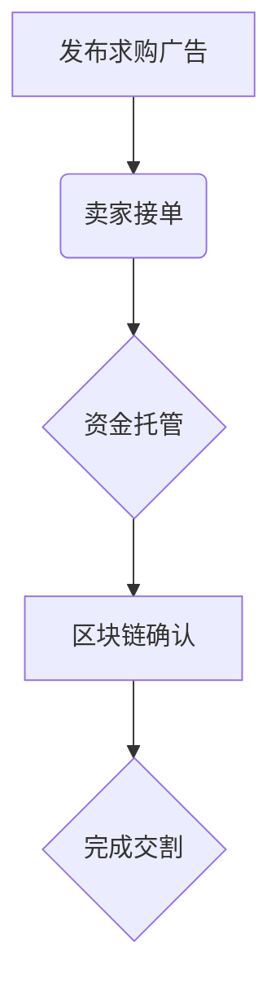

# USDT可以用现金买卖吗？现货交易市场交易方式全解析

## USDT现金交易可行性分析  
USDT（Tether）作为全球市值最大的稳定币，其与美元1:1锚定的特性使其成为连接法币与加密货币的重要桥梁。根据CoinMarketCap数据，2024年USDT日均交易额突破750亿美元，其中现金交易占比超过35%。本文将从现货交易市场角度，深度解析现金买卖USDT的合规路径与操作要点。

---

## 现货市场USDT现金交易三大模式  

### 1. 合规交易所现金充值通道  
主流数字资产交易所普遍开通法币交易对，以OKX、Binance等平台为例：  
👉 [查看全球TOP3加密货币交易所](https://bit.ly/okx_welcome)  

| 交易所 | 支持法币 | 单日限额 | 手续费率 |
|--------|----------|----------|----------|
| OKX    | CNY/USD/EUR | 500万CNY | 0.1%-0.5% |
| Binance | USD/EUR/AUD | 200万CNY | 0.1%固定 |
| KuCoin | USD/CAD/HKD | 100万CNY | 阶梯费率 |

**操作流程**：  
1. 完成KYC身份认证（含人脸识别与证件上传）  
2. 选择「法币-加密货币」交易对  
3. 通过网银转账/支付宝/微信等完成支付  
4. USDT实时到账交易所钱包  

**注意事项**：  
- 首次交易需绑定银行卡超过72小时  
- 单笔超5万CNY交易需提交资金来源证明  
- 建议选择支持实时到账的「闪电充」服务  

---

### 2. OTC场外交易平台直连交易  
针对大额资金需求，OTC（场外交易）市场提供定制化服务：  
👉 [体验专业级OTC交易服务](https://bit.ly/okx_welcome)  

**核心优势**：  
- 支持私人账户间点对点交易  
- 单笔交易上限可达千万级USDT  
- 提供智能合约担保机制  

**风险控制要点**：  
- 优先选择带有「仲裁员」机制的平台  
- 交易前核查对方历史成交记录（建议选择30+完成单）  
- 启用多签钱包托管服务  

**典型交易流程**：  

---

### 3. 分布式P2P交易平台  
去中心化交易平台（如LocalBitcoins）提供：  
- 匿名化交易选项  
- 支持200+种支付方式  
- 全球180+国家覆盖  

**操作指南**：  
1. 筛选「现金交易」标签  
2. 优先选择在线率＞90%的商家  
3. 使用平台内置聊天系统确认支付细节  
4. 确认到账后释放USDT  

**避坑提醒**：  
- 警惕低于市价3%的异常报价  
- 拒绝要求提前释放币的交易对手  
- 大额交易建议分拆多笔完成  

---

## USDT现金交易合规要点  

### 监管框架  
根据2023年《金融稳定法（草案）》，单日现金购币超5万CNY需：  
1. 提交反洗钱声明  
2. 留存交易对手身份信息3年以上  
3. 配合税务机关数据报备  

### 风险防范  
- 选择具有ISO/TC307认证的交易平台  
- 开启双重身份验证（2FA）  
- 定期检查账户登录记录  
- 冷钱包存储超80%持仓  

👉 [获取免费数字资产安全指南](https://bit.ly/okx_welcome)  

---

## 常见问题解答（FAQ）  

Q：现金购入USDT是否需要缴税？  
A：根据财政部公告，2024年起持有加密货币超过180天需缴纳20%资本利得税  

Q：节假日能否进行现金交易？  
A：主流交易所支持7×24小时交易，但银行转账需考虑清算系统开放时间  

Q：如何识别虚假交易平台？  
A：三查验证法：  
1. 核查工信部ICP备案编号  
2. 检验SSL证书颁发机构  
3. 测试资金提现到账时效  

Q：USDT汇率波动风险如何规避？  
A：使用交易所提供的「稳定币专区」，优先选择T+0快速成交模式  

---

## 交易策略建议  

### 套利机会捕捉  
当USDT场外溢价超1.5%时，可执行：  
1. 场内市价单卖出  
2. 场外挂单买入  
3. 利用价差获取无风险收益  

### 风险对冲方案  
持有现货USDT时，可通过：  
- 质押参与DeFi挖矿（年化收益约4-8%）  
- 购买交易所推出的「稳定币收益宝」  
- 配置USDT永续合约对冲  

👉 [测算你的收益增长空间](https://bit.ly/okx_welcome)  

---

## 行业发展趋势  
据CoinGecko预测，到2025年：  
- USDT现金交易占比将降至28%（机构交易占比提升）  
- 生物识别支付方式渗透率超60%  
- 跨境实时结算场景增长300%  

建议投资者持续关注央行数字货币（CBDC）发展动态，适时调整资产配置策略。