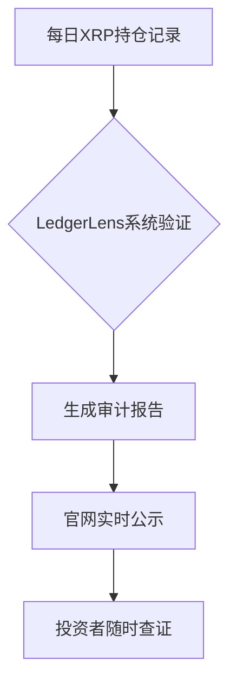

# XRP加密货币ETP - 首款XRP投资产品

## 产品核心优势

CoinShares XRP加密货币ETP为投资者提供安全、透明且成本效益显著的XRP资产配置方案。该产品通过实物支持模式，实现对Ripple网络原生资产的直接投资，为机构及个人投资者开辟了参与数字资产市场的合规路径。

👉 [立即体验全球领先交易平台](https://bit.ly/okx_welcome)

### 创新投资工具

作为欧洲首个获得监管批准的XRP ETP产品，其创新性体现在：
- **实物锚定机制**：每份ETP均对应真实持有的XRP数字资产
- **多币种交易**：支持美元、欧元、瑞士法郎等主流货币交易
- **全球流动性**：在德国Xetra、瑞士SIX等主要交易所上市交易

### 三大核心价值

| 价值维度 | 产品特性 | 用户收益 |
|---------|----------|----------|
| 安全保障 | Komainu托管+季度审计 | 资产安全透明可验证 |
| 成本效率 | 管理费率低至0.5% | 降低长期持有成本 |
| 交易便捷 | 传统证券账户即可交易 | 无需数字钱包操作 |

## 产品运作机制

### 实物支持体系

CoinShares建立完整的实物支持生态：
1. **资产托管**：通过Komainu持有等量XRP
2. **动态平衡**：每日更新资产储备数据
3. **透明验证**：通过The Network Firm第三方审计

### 储备验证流程

👉 [深度解析数字资产托管方案](https://bit.ly/okx_welcome)

## 全球交易网络

### 多市场布局

| 交易所 | 上市日期 | 交易代码 | 基础货币 |
|--------|----------|----------|----------|
| Xetra德国 | 2022-04-08 | XRRL GY | 欧元 |
| 瑞士SIX | 2021-04-13 | XRPL SE | 美元 |
| 瑞士SIX | 2021-04-13 | XRPLCHF SE | 瑞士法郎 |
| 巴黎Euronext | 2025-03-17 | XRPL FP | 欧元 |

### 交易参数对照

| 指标 | 实物ETP | 期货合约 | 交易所现货 |
|------|---------|----------|------------|
| 杠杆倍数 | 1x | 5-10x | 无 |
| 资金效率 | T+2交割 | 每日展期 | 实时到账 |
| 交易成本 | 0.5%管理费 | 展期溢价 | 交易手续费 |

## 合规架构解析

### 法律框架

- **发行地**：泽西岛（Jersey）
- **产品类型**：债务证券（ETP）
- **监管机构**：泽西金融监管委员会（JFSC）

### 风险管理机制

1. **资产隔离**：托管资产与公司资产完全分离
2. **动态对冲**：应对极端市场波动
3. **压力测试**：季度性模拟极端行情

👉 [获取专业投资产品评估指南](https://bit.ly/okx_welcome)

## 投资者常见问题

### Q1：XRP与Ripple有何关联？
A：XRP是Ripple网络的原生加密货币，Ripple公司开发了XRP账本及RippleNet跨境支付解决方案。CoinShares ETP直接投资于XRP代币，不涉及企业股权。

### Q2：如何验证产品的真实性？
A：通过官网"Proof of Reserves"页面，可实时查看区块链地址的XRP持有量，与The Network Firm的审计报告交叉验证。

### Q3：产品适合哪些投资者？
A：适合寻求：
- 降低数字资产托管风险的机构投资者
- 传统金融渠道参与加密市场的个人投资者
- 跨境支付场景的流动性管理需求者

### Q4：如何应对市场波动风险？
A：建议采用：
1. 定投策略（DCA）
2. 仓位控制（建议不超过数字资产配置的20%）
3. 结合期权工具对冲

## 购买全流程指南

### 四步投资法

1. **获取产品代码**
   - EUR计价版：XRPL FP（巴黎市场）
   - USD计价版：XRPL SE（苏黎世市场）

2. **登录证券账户**
   - 支持主流券商：Interactive Brokers、DEGIRO、Saxo Bank等

3. **执行交易指令**
   - 最小交易单位：1手（约500欧元）
   - 交易时间：参照各交易所具体时段

4. **持仓管理**
   - 自动分红机制：季度收益再投资
   - 实时查询：通过CoinShares Investor Portal

### 专业服务支持

- **机构客户服务**：提供定制化做市服务
- **投资者教育**：每周网络研讨会
- **市场分析报告**：每日发送市场动态

## 市场发展展望

### 跨境支付革新

根据SWIFT统计，全球跨境支付年均增长6.3%，XRP在以下场景展现优势：
- 银行间实时结算
- 企业外汇对冲
- 数字资产做市商流动性管理

### 合规化进程

2024年欧盟MiCA法规实施后，CoinShares已获得：
- 泽西金融服务委员会（JFSC）完全授权
- 英国FCA注册资格
- 瑞士FINMA监管沙盒准入

### 技术演进路径

| 发展阶段 | 核心功能 | 上线时间 |
|---------|----------|----------|
| Phase 1 | 基础ETP架构 | 2021 |
| Phase 2 | 多币种支持 | 2022 |
| Phase 3 | 质押收益功能 | 2024 Q4 |
| Phase 4 | DeFi连接模块 | 2025 Q2 |
