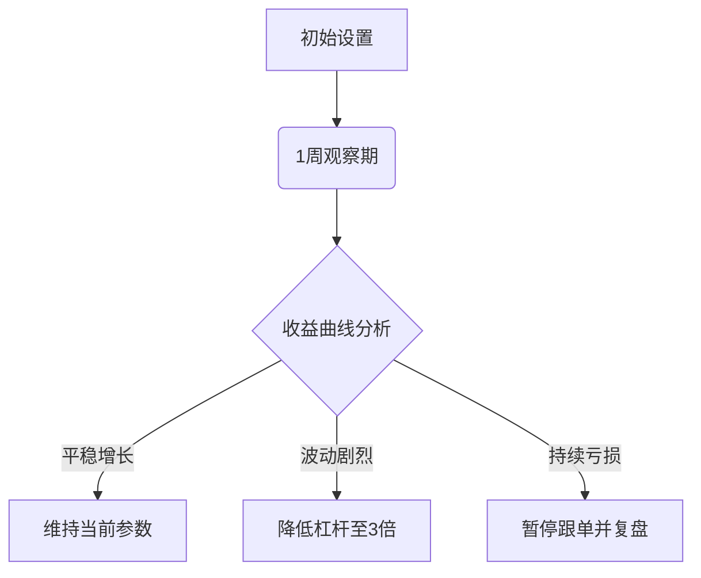

# 【跟单者】如何进行跟单交易？

## 跟单交易全流程解析（网页端）

在欧易OKX平台进行跟单交易，可通过以下步骤实现：

1. **入口导航**
   👉 [立即体验智能跟单功能](https://bit.ly/okx_welcome)，点击顶部导航栏【发现】→【跟单】（需先完成账户登录）

2. **交易员筛选**
   - 进入【跟单广场】后，通过以下维度筛选优质交易员：
     - 历史收益率（建议选择连续3个月正收益的交易员）
     - 最大回撤率（优选低于15%的稳健型策略）
     - 跟单人数（万人以上跟随的"明星交易员"更具参考价值）

3. **个性化配置**
   | 配置项 | 参数说明 | 操作建议 |
   |---|---|---|
   | 单笔跟随金额 | 每笔订单固定保证金 | 新手建议设置为账户总资金的1-2% |
   | 最大跟随金额 | 保证金总额上限 | 需高于单笔金额的10倍以保证持续跟随 |
   | 仓位模式 | 与合约交易页面同步 | 建议采用"双向持仓"提高灵活性 |
   | 杠杆倍数 | 需在合约页面统一设置 | 初学者推荐3-5倍安全杠杆 |

4. **风控设置技巧**
   - 止盈机制：设置100%-130%区间，平衡收益与资金利用率
   - 止损策略：建议控制在8%-12%范围，避免过度波动风险
   - 合约选择：优先勾选主流币种（BTC/ETH等流动性高的标的）

**操作验证**：完成设置后，系统会弹出二次确认窗口，建议逐项核对以下信息：
- 保证金占用比例是否合理
- 止盈止损阈值是否符合预期
- 跟随合约的流动性指标

---

## 移动端跟单操作指南

通过手机APP操作时，核心流程保持一致：

1. **发现入口**：在APP首页底部导航栏选择【发现】→【跟单】
2. **智能筛选功能**：
   - 使用"收益率排序"快速定位优质交易员
   - 开启"新手专区"筛选低风险策略
   - 查看"实时跟单动态"了解市场热点

3. **移动端专属优化**：
   - 摇一摇刷新：获取最新交易员排名
   - 推送提醒：设置重要交易信号通知
   - 快捷平仓：一键管理所有跟随订单

**保证金管理建议**：
```text
账户总资金 10,000 USDT
└─ 单笔跟随金额 100 USDT（1%）
└─ 最大跟随金额 1,500 USDT（15%）
   ├─ 可同时跟随15笔订单
   └─ 保留85%资金应对极端行情
```

---

## 智能跟单FAQ

**Q：如何判断交易员的策略是否适合自己？**  
A：建议通过三个维度评估：  
1. 策略周期匹配度（日内/波段/长线）  
2. 风险收益比（最大回撤/年化收益）  
3. 资金规模变化（持续增长型优于大起大落）

**Q：最大跟随金额设置过低会有什么影响？**  
A：可能导致：  
- 错过优质交易机会  
- 资金利用率不足  
- 收益曲线波动加剧  
建议设置为账户总资金的15%-25%

**Q：止盈止损参数调整频率如何把控？**  
A：遵循"三不原则"：  
❌ 频繁调整（每日不超过3次）  
❌ 盲目跟随（需结合市场波动率）  
❌ 极端参数（止盈建议≤130%，止损≥8%）

**Q：如何优化仓位分配效果？**  
A：采用"动态平衡法"：  
1. 初始配置：单品种≤5%资金  
2. 止盈后：自动追加30%仓位  
3. 止损后：暂停该标的3日观察

---

## 高级配置策略

**组合配置模型示例**：
| 交易员类型 | 分配比例 | 风控参数 | 适用场景 |
|---|---|---|---|
| 稳健型 | 40% | 止盈100%/止损10% | 行情震荡期 |
| 激进型 | 30% | 止盈130%/止损12% | 趋势行情 |
| 套利型 | 20% | 止盈80%/止损5% | 行情不明朗 |
| 自选标的 | 10% | 手动设置 | 特殊策略测试 |

**市场周期应对策略**：
- **牛市行情**：适当提高最大跟随金额至20%
- **震荡市**：缩短跟单周期至72小时
- **黑天鹅事件**：启用"自动休眠"功能

👉 [获取实时市场分析工具](https://bit.ly/okx_welcome)，助您精准判断行情阶段

---

## 风险控制进阶

**异常波动应对方案**：
1. **熔断机制**：当单笔亏损达账户5%时自动暂停
2. **分批止盈**：将止盈目标拆分为3个阶段执行
3. **对冲策略**：为高波动交易员配置反向仓位

**参数优化路线图**：


---

## 智能跟单生态体系

OKX跟单平台三大核心优势：
1. **透明化数据**：提供200+维度的交易员画像
2. **智能匹配系统**：根据风险偏好自动推荐组合
3. **沙盒测试功能**：模拟跟单验证策略有效性

**跟单者成长路径**：
```
新手期(0-3月) → 稳定期(3-6月) → 专业期(6月+)
    ↓                ↓                ↓
基础策略配置     组合优化       定制化策略开发
```

👉 [参与跟单者成长计划](https://bit.ly/okx_welcome)，获取专业培训资源

---

## 市场动态响应机制

**实时预警系统**：
- 极端行情提醒（24小时推送）
- 交易员异动预警（持仓突变监测）
- 资金费率提示（自动计算持仓成本）

**参数优化工具包**：
1. 止盈止损模拟器
2. 仓位优化计算器
3. 收益波动率分析

**社群互动价值**：
- 跟单者交流专区（实时策略讨论）
- 专家直播解读（每周行情复盘）